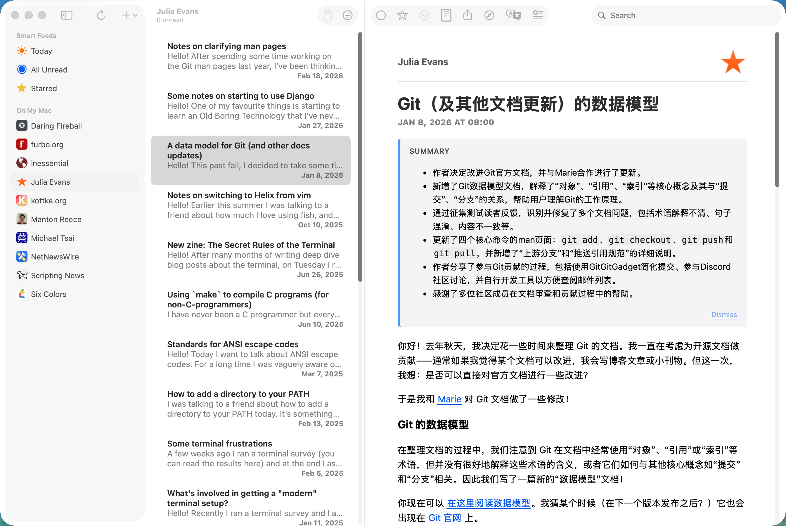
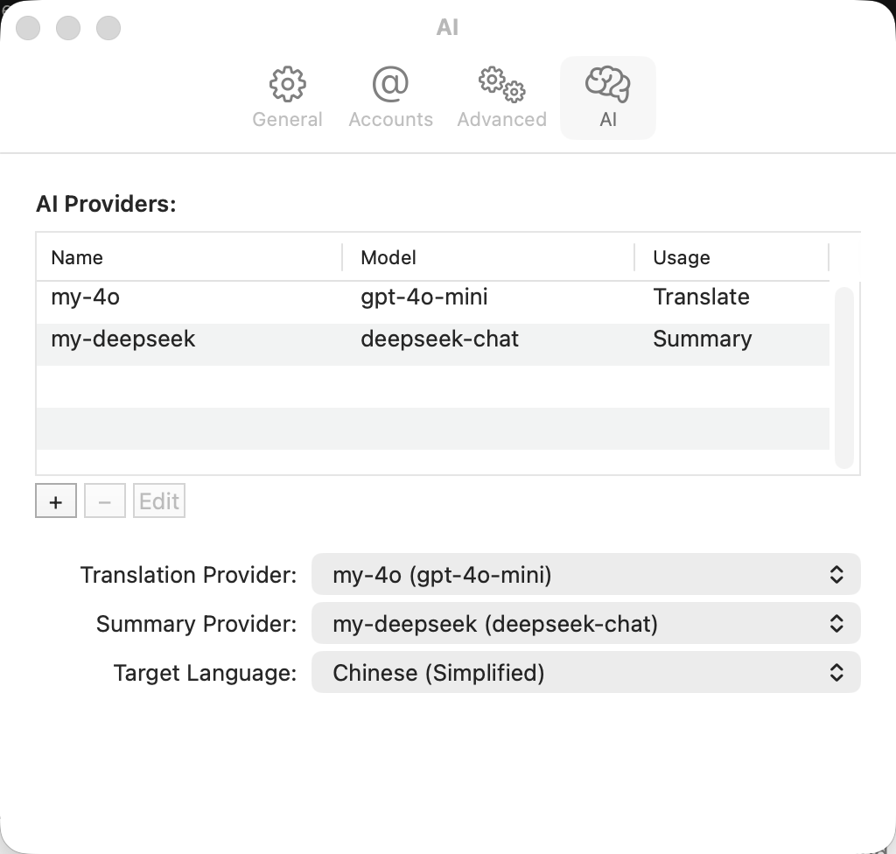

# NetNewsWire (Fork)

[View English README](README.md)

这是 [Ranchero-Software/NetNewsWire](https://github.com/Ranchero-Software/NetNewsWire) 的 fork 版本，在上游基础上增加了 AI 功能。

NetNewsWire 是一个免费开源的 macOS/iOS 订阅阅读器，支持 [RSS](https://cyber.harvard.edu/rss/rss.html)、[Atom](https://datatracker.ietf.org/doc/html/rfc4287)、[JSON Feed](https://jsonfeed.org/) 和 [RSS-in-JSON](https://github.com/scripting/Scripting-News/blob/master/rss-in-json/README.md) 格式。

## 本 Fork 新增功能

### AI 翻译与摘要 (macOS)

本 fork 为 NetNewsWire 添加了 AI 驱动的文章翻译和摘要功能。使用 OpenAI 兼容 API 协议，因此支持任何实现该标准的服务商。



**支持的服务商包括（不限于）：**

- OpenAI (gpt-4o, gpt-4o-mini 等)
- DeepSeek
- Google Gemini（通过 OpenAI 兼容接口）
- Anthropic Claude（通过 OpenAI 兼容接口）
- 任何自部署的 OpenAI 兼容服务（Ollama、LM Studio 等）

**功能特性：**

- **文章翻译** -- 将文章标题和正文翻译为目标语言。再次点击工具栏按钮可还原原文。
- **文章摘要** -- 生成摘要并显示在文章顶部，支持关闭按钮。
- **16 种目标语言** -- 简体中文、繁体中文、英语、日语、韩语、法语、德语、西班牙语、葡萄牙语、俄语、阿拉伯语、意大利语、荷兰语、泰语、越南语、印尼语。
- **自定义提示词** -- 可为每个服务商配置自定义的翻译和摘要提示词。
- **多服务商** -- 可添加多个服务商，并分别指定用于翻译和摘要的服务商。
- **安全存储** -- API Key 存储在 macOS 钥匙串 (Keychain) 中，不会以明文保存在配置文件中。
- **阅读器视图集成** -- 当阅读器视图启用时，AI 使用提取后的干净内容，效果更好。
- **任务取消** -- 切换文章时自动取消进行中的 AI 请求，避免浪费 token。

## 配置指南

### AI 配置

1. 打开 **NetNewsWire > 设置**（或按 `Cmd + ,`）。
2. 进入 **AI** 标签页。



#### 第一步：添加服务商

点击 AI Providers 表格下方的 **+** 按钮，添加新的服务商。填写以下字段：

| 字段 | 说明 | 示例 |
|---|---|---|
| **Name** | 服务商的显示名称 | `My OpenAI` |
| **Endpoint URL** | API 端点地址。应用会自动规范化（补全 `https://` 和 `/v1/chat/completions`）。 | `https://api.openai.com` |
| **API Key** | 服务商提供的 API 密钥 | `sk-...` |
| **Model** | 要使用的模型标识符 | `gpt-4o-mini` |
| **Translation Prompt** | （可选）翻译的自定义系统提示词。目标语言会自动追加，无需手动指定。 | |
| **Summary Prompt** | （可选）摘要的自定义系统提示词。目标语言会自动追加，无需手动指定。 | |

#### 第二步：指定服务商

- **Translation Provider** -- 从下拉菜单选择用于翻译的服务商。
- **Summary Provider** -- 从下拉菜单选择用于摘要的服务商。
- 可以为两者使用同一个服务商，也可以分别指定不同的服务商。

#### 第三步：选择目标语言

从 **Target Language** 下拉菜单中选择你的目标语言。默认为 `Chinese (Simplified)`（简体中文）。

### 使用方法

配置好服务商后，主窗口工具栏会出现两个新按钮：

- **翻译**（翻译图标）-- 点击翻译当前文章。再次点击还原原文。
- **摘要**（星标图标）-- 点击生成摘要，显示在文章顶部。

如果对应功能未配置服务商，会弹出对话框提示你前往设置页面配置。

## 构建

无需付费开发者账号即可构建。

```bash
git clone https://github.com/Poco0v0/NetNewsWire.git
cd NetNewsWire

xcodebuild -project NetNewsWire.xcodeproj \
  -scheme NetNewsWire \
  -configuration Debug \
  -destination "platform=macOS,arch=arm64" \
  CODE_SIGN_IDENTITY="" CODE_SIGNING_REQUIRED=NO CODE_SIGNING_ALLOWED=NO \
  SWIFT_TREAT_WARNINGS_AS_ERRORS=NO \
  build
```

详细的环境搭建说明请参考 [doc/开发环境搭建.md](doc/开发环境搭建.md)。

## 下载

预构建的安装包可以在 [Releases](https://github.com/Poco0v0/NetNewsWire/releases) 页面下载。

由于应用未签名，macOS 首次启动时会阻止打开。解决方法：

1. 双击应用，macOS 会阻止打开。
2. 打开 **系统设置 > 隐私与安全性**。
3. 点击 **仍要打开**。

## 上游项目

关于原版 NetNewsWire 的信息，请访问 [Ranchero-Software/NetNewsWire](https://github.com/Ranchero-Software/NetNewsWire)。
